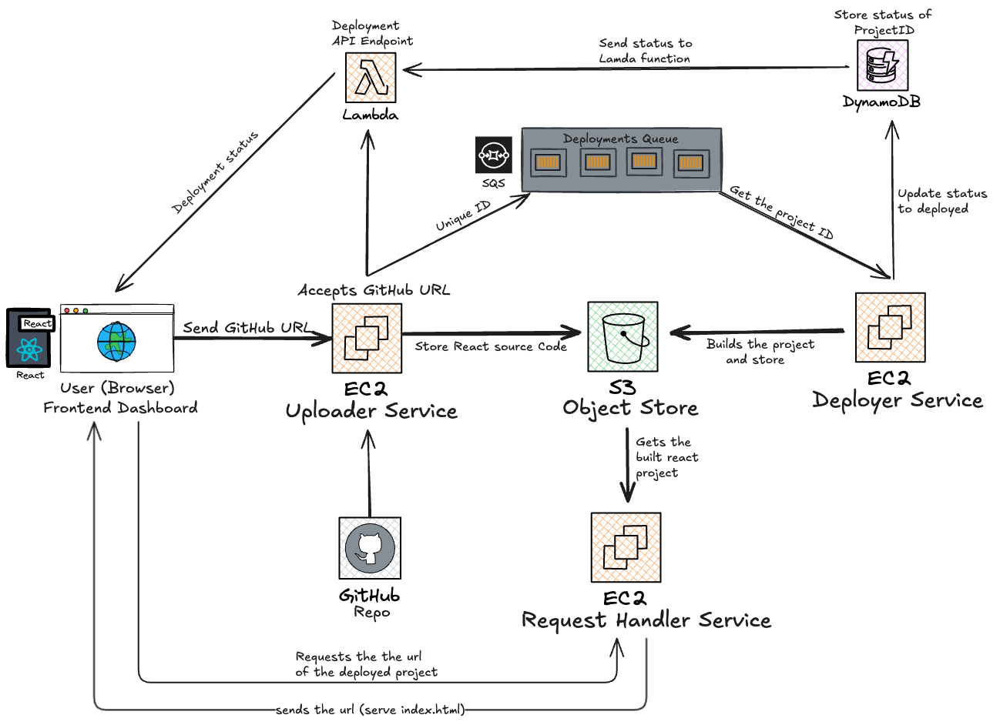

# Vercel Clone - GitHub Repository Deployment Platform

A full-stack application that clones GitHub repositories and deploys them as static websites, similar to Vercel's functionality. Built with React, Node.js, TypeScript, and AWS services.

## 🏗️ Architecture

This project follows a microservices architecture with four main services:

### Frontend Service
- **Technology**: React + TypeScript + Vite + Tailwind CSS + AWS
- **Purpose**: User interface for uploading GitHub repository URLs
- **Port**: 5173 (Vite dev server)

### Upload Service
- **Technology**: Node.js + Express + TypeScript
- **Purpose**: Handles repository cloning, file upload to S3, and deployment queue management
- **Port**: 3000

### Deploy Service
- **Technology**: Node.js + TypeScript
- **Purpose**: Background service that processes deployment queue, builds projects, and uploads built files
- **Port**: N/A (Background service)

### Request Handler Service
- **Technology**: Node.js + Express + TypeScript
- **Purpose**: Serves deployed static websites by fetching files from S3
- **Port**: 3003

## 🚀 Features

- **GitHub Repository Cloning**: Automatically clones repositories from GitHub URLs
- **Static Site Deployment**: Builds and deploys React/Vite projects
- **Real-time Status Updates**: Tracks deployment progress with status updates
- **Custom Domains**: Each deployment gets a unique subdomain
- **AWS Integration**: Uses S3 for file storage, SQS for queue management, and DynamoDB for status tracking

## 🛠️ Tech Stack

### Frontend
- React 19.1.1
- TypeScript 5.8.3
- Vite 7.1.2
- Tailwind CSS 4.1.11
- Axios for API calls
- ShadCN UI components
- AWS

### Backend Services
- Node.js
- Express.js 5.1.0
- TypeScript 5.9.2
- AWS SDK v3

### AWS Services
- **S3**: File storage for repository files and built assets
- **SQS**: Message queue for deployment processing
- **DynamoDB**: Deployment status tracking
- **Simple Git**: Repository cloning

## 📁 Project Structure

```
vercel_clone/
├── frontend/                 # React frontend application
│   ├── src/
│   │   ├── components/       # UI components
│   │   │   ├── form.tsx     # Main deployment form
│   │   │   └── ui/          # Reusable UI components
│   │   └── App.tsx          # Main app component
│   └── package.json
├── upload_service/           # Repository upload and queue service
│   ├── src/
│   │   ├── index.ts         # Main server file
│   │   ├── S3.ts           # S3 upload functionality
│   │   ├── sqs.ts          # SQS queue operations
│   │   ├── dynamoDB.ts     # DynamoDB operations
│   │   └── output/         # Cloned repositories
│   └── package.json
├── deploy_service/          # Background deployment processor
│   ├── src/
│   │   ├── index.ts        # Main service file
│   │   ├── aws.ts          # AWS operations
│   │   └── utils.ts        # Utility functions
│   └── package.json
├── request-handler-service/ # Static file server
│   ├── src/
│   │   ├── index.ts        # Main server file
│   │   └── aws.ts          # S3 file retrieval
│   └── package.json
└── .gitignore
```

## 🚀 Getting Started

### Prerequisites

- Node.js (v18 or higher)
- AWS Account with configured credentials
- AWS Services: S3, SQS, DynamoDB

### Environment Variables

Create `.env` files in each service directory with the following variables:

```env
# AWS Configuration
AWS_ACCESS_KEY_ID=your_access_key
AWS_SECRET_ACCESS_KEY=your_secret_key
AWS_REGION=us-east-2
AWS_BUCKET_NAME=your_s3_bucket_name
AWS_SQS_URL=your_sqs_queue_url

# DynamoDB
DYNAMODB_TABLE_NAME=your_dynamodb_table_name
```

### Installation

1. **Clone the repository**
   ```bash
   git clone <repository-url>
   cd vercel_clone
   ```

2. **Install dependencies for all services**
   ```bash
   # Frontend
   cd frontend
   npm install
   
   # Upload Service
   cd ../upload_service
   npm install
   
   # Deploy Service
   cd ../deploy_service
   npm install
   
   # Request Handler Service
   cd ../request-handler-service
   npm install
   ```

3. **Start the services**

   **Terminal 1 - Frontend:**
   ```bash
   cd frontend
   npm run dev
   ```

   **Terminal 2 - Upload Service:**
   ```bash
   cd upload_service
   npm run dev
   ```

   **Terminal 3 - Deploy Service:**
   ```bash
   cd deploy_service
   npm run dev
   ```

   **Terminal 4 - Request Handler Service:**
   ```bash
   cd request-handler-service
   npm run dev
   ```

## 🔄 How It Works

1. **Repository Upload**: User enters a GitHub repository URL in the frontend
2. **Cloning**: Upload service clones the repository locally
3. **File Upload**: All repository files are uploaded to S3
4. **Queue Processing**: Deployment request is added to SQS queue
5. **Background Processing**: Deploy service picks up queue messages
6. **Building**: Project is built using `npm install` and `npm run build`
7. **Deployment**: Built files are uploaded to S3 with unique identifiers
8. **Serving**: Request handler service serves the deployed files
9. **Status Updates**: Deployment status is tracked in DynamoDB

## 🎯 Usage

1. Open the frontend application (http://localhost:5173)
2. Enter a GitHub repository URL (must be a React/Vite project)
3. Click "Deploy"
4. Wait for the deployment to complete
5. Access your deployed site at `http://{deployment-id}.glider.com:3003/index.html`

## 🔌 API Endpoints

### Upload Service (Port 3000)
- `POST /upload` - Upload and queue a repository for deployment
- `GET /status/:projectId` - Get deployment status
- `GET /dequeue` - Manually dequeue a message (for testing)

### Request Handler Service (Port 3003)
- `GET /{*any}` - Serve deployed static files


## 🏗️ Architecture

This project follows a microservices architecture with four main services:



## 🔧 Development

### Available Scripts

**Frontend:**
- `npm run dev` - Start development server
- `npm run build` - Build for production
- `npm run preview` - Preview production build

**All Backend Services:**
- `npm run dev` - Start development server
- `npm run build` - Build TypeScript
- `npm start` - Start production server

## ⚠️ Important Notes

- The system is designed for React/Vite projects
- Each deployment gets a unique ID for isolation
- Built files are stored in S3 with the pattern `dist/{deployment-id}/`
- The request handler service expects files to be served from the `dist` directory
- Make sure your GitHub repository has a valid `package.json` with build scripts

## 📄 License

This project is licensed under the ISC License.


---

**Note**: This is a simplified Vercel clone for educational purposes. For production use, consider additional features like authentication, custom domains, environment variables, and more robust error handling. 
